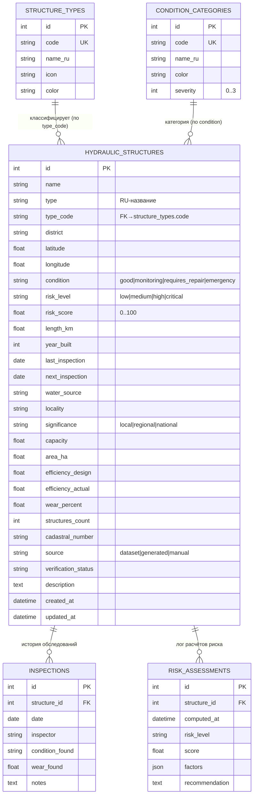

# ERD — HydraTechnology

Диаграмма сущностей базы данных (рендерится на GitHub как Mermaid).

## Заметки по проектированию
- `type`/`condition` денормализованы в `HYDRAULIC_STRUCTURES` строковыми кодами —
  это 1:1 совпадает с контрактом фронтенда и ускоряет аналитику (group by без join).
  Таблицы `STRUCTURE_TYPES` / `CONDITION_CATEGORIES` остаются справочниками
  (цвета, иконки, лейблы, порядок).
- Координаты хранятся как `float lat/lng` — без PostGIS (для масштаба хакатона
  достаточно; расстояния считаются по Haversine в `services/geo.py`).
- `RISK_ASSESSMENTS.factors` (JSON) хранит разбор риска по факторам —
  прозрачность для жюри и вход для AI-диспетчера.
